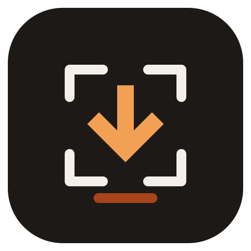

<div align="center">
  
  <h1>FramePort</h1>
  <p><strong>ดาวน์โหลดวิดีโอและแปลงไฟล์ให้ง่าย พร้อมใช้งานบน Windows</strong></p>
  <p>
    <a href="https://CandyCoreProj.github.io/FramePort/">เว็บไซต์และดาวน์โหลด</a>
    · <a href="https://github.com/CandyCoreProj/FramePort/releases">รุ่นล่าสุด</a>
    · <a href="https://github.com/CandyCoreProj/FramePort/issues">แจ้งปัญหา</a>
  </p>
</div>

FramePort เป็นโปรแกรม Windows สำหรับดาวน์โหลดวิดีโอหรือเสียงจากลิงก์ แล้วบันทึกเป็นไฟล์ที่พร้อมใช้งานต่อ เลือกคุณภาพ เลือกโฟลเดอร์ และแปลงวิดีโอด้วย CPU หรือ GPU ได้จากหน้าจอเดียว

## ดาวน์โหลดและติดตั้ง

ไปที่ [เว็บไซต์ FramePort](https://CandyCoreProj.github.io/FramePort/) หรือ [หน้า Releases](https://github.com/CandyCoreProj/FramePort/releases) แล้วเลือกไฟล์ที่ต้องการ:

- **Setup**: ติดตั้งลงเครื่องและสร้างทางลัด
- **Portable**: เปิดโปรแกรมจากไฟล์โดยไม่ต้องติดตั้ง

รองรับ Windows x64 ทั้งสองแบบ ในการเปิดใช้งานครั้งแรก โปรแกรมต้องเชื่อมต่ออินเทอร์เน็ตเพื่อติดตั้งเครื่องมือที่จำเป็น:

- yt-dlp สำหรับดาวน์โหลด (ประมาณ 18 MB)
- FFmpeg สำหรับแปลงวิดีโอและเสียง (ประมาณ 150 MB)

FramePort ดาวน์โหลดเครื่องมือเหล่านี้เมื่อจำเป็น แทนการรวมไว้ในตัวติดตั้งหลัก

## ความสามารถ

- ดาวน์โหลดวิดีโอเป็น MP4 หรือเลือกดาวน์โหลดเฉพาะเสียงเป็น MP3, FLAC หรือ WAV
- เลือกความละเอียด Best, 4K, 2K, 1080p, 720p หรือ 480p ตามไฟล์ต้นทาง
- เลือก H.264 หรือ H.265 เพื่อแปลงวิดีโอด้วยค่าคุณภาพสูง หรือเลือก “ต้นฉบับ” เพื่อเก็บภาพโดยไม่เข้ารหัสใหม่
- เลือกการเข้ารหัสอัตโนมัติ, CPU x264 หรือโหมด CPU ถอดรหัสร่วมกับ GPU เข้ารหัส
- รองรับ NVIDIA NVENC/CUDA, Intel Quick Sync และ AMD AMF เมื่ออุปกรณ์และไดรเวอร์รองรับ
- สลับใช้ CPU ได้เมื่อ GPU encoder ใช้ไม่ได้
- ดาวน์โหลดทั้งเพลย์ลิสต์ได้เมื่อเลือกตัวเลือกนี้
- ใช้ชื่อคลิปเป็นชื่อไฟล์ หากมีชื่อเดิมอยู่แล้วจะเพิ่มเลขท้ายชื่อ เช่น `ชื่อคลิป 2.mp4`, `ชื่อคลิป 3.mp4` ในโฟลเดอร์เดิม
- ใช้งานหน้าจอได้ทั้งภาษาไทยและภาษาอังกฤษ พร้อมธีมสว่างและมืด
- ตั้งภาษาเริ่มต้นตามประเทศของ IP เป็นไทยหรืออังกฤษ และจำภาษาที่ผู้ใช้เลือกเอง

การรองรับวิดีโอขึ้นอยู่กับเว็บไซต์และ yt-dlp รุ่นที่ใช้งาน ความเร็วการแปลงด้วย GPU ขึ้นอยู่กับฮาร์ดแวร์ ไดรเวอร์ และรูปแบบวิดีโอต้นทาง

## วิธีใช้งาน

1. เปิด FramePort แล้ววางลิงก์วิดีโอ
2. เลือกวิดีโอหรือเสียง คุณภาพ และตำแหน่งบันทึก
3. ถ้าต้องการแปลงวิดีโอ ให้เลือกโหมด CPU/GPU ที่ต้องการ
4. กดดาวน์โหลดและติดตามความคืบหน้าในโปรแกรม

ไฟล์จะบันทึกในโฟลเดอร์ Downloads เป็นค่าเริ่มต้น และเปลี่ยนโฟลเดอร์ได้จากหน้าหลัก

## สร้างโปรแกรมจากซอร์สโค้ด

ต้องติดตั้ง Node.js ก่อน จากนั้นเปิด PowerShell ในโฟลเดอร์โปรเจกต์:

```powershell
npm install
npm start
```

สร้างตัวติดตั้ง Windows x64 และรุ่น Portable:

```powershell
npm run dist
```

ไฟล์ที่สร้างจะอยู่ใน `dist/` โฟลเดอร์นี้ถูกละเว้นโดย Git เพื่อไม่เก็บตัวติดตั้งขนาดใหญ่ไว้ในประวัติซอร์สโค้ด

ตรวจพฤติกรรมเลือกภาษาอัตโนมัติได้ด้วย `npm run test:language`.

## โครงสร้างโปรเจกต์

| ไฟล์/โฟลเดอร์ | หน้าที่ |
| --- | --- |
| `main.js` | Electron main process, ดาวน์โหลดไฟล์ และเรียก FFmpeg |
| `preload.js` | สะพาน API ระหว่างหน้าจอกับ main process |
| `index.html`, `renderer.js` | หน้าจอโปรแกรมและการโต้ตอบ |
| `docs/language.js` | ตรวจประเทศจาก IP และเลือกภาษาเริ่มต้น |
| `test-language.js` | ตรวจการเลือกภาษาตามประเทศและ fallback |
| `build/` | ไอคอนโปรแกรมและสคริปต์สร้างไอคอน |
| `docs/` | เว็บไซต์แนะนำและดาวน์โหลด FramePort |
| `.github/workflows/pages.yml` | เผยแพร่เว็บไซต์ด้วย GitHub Pages |

## หมายเหตุ

FramePort ใช้ [yt-dlp](https://github.com/yt-dlp/yt-dlp) และ [FFmpeg](https://ffmpeg.org/) ซึ่งดาวน์โหลดเมื่อติดตั้งเครื่องมือครั้งแรก โปรดปฏิบัติตามข้อกำหนดของเว็บไซต์และดาวน์โหลดเฉพาะเนื้อหาที่คุณมีสิทธิ์ใช้งาน

ภาษาเริ่มต้นตรวจ country code ของ IP โดยประมาณผ่าน [ipwho.is](https://ipwhois.io/) และแคชรหัสประเทศไว้ในเครื่อง 24 ชั่วโมง บริการจะได้รับ public IP เพื่อระบุประเทศเท่านั้น ไม่ขอตำแหน่ง GPS หากตรวจไม่ได้จะใช้ภาษาอุปกรณ์หรือเขตเวลาแทน ผู้ใช้ยังเปลี่ยนภาษาเองได้

---

## English

FramePort is a Windows desktop app for downloading video or audio from a link and saving a file that is ready to use. Choose the quality, output folder, and CPU or GPU conversion mode from one simple screen.

### Download

Get FramePort from the [website](https://CandyCoreProj.github.io/FramePort/) or the [GitHub Releases page](https://github.com/CandyCoreProj/FramePort/releases):

- **Setup** installs the app and creates shortcuts.
- **Portable** runs directly from the downloaded file without installation.

Both releases support Windows x64. On first launch, an internet connection is needed to install the required tools:

- yt-dlp for downloading (about 18 MB)
- FFmpeg for video and audio conversion (about 150 MB)

These tools are downloaded when needed instead of being bundled into the main installer.

### Features

- Download video as MP4 or audio as MP3, FLAC, or WAV.
- Choose Best, 4K, 2K, 1080p, 720p, or 480p when available from the source.
- Convert to high-quality H.264 or H.265, or choose Original to keep the video without re-encoding.
- Choose automatic encoding, CPU x264, or CPU decoding with GPU encoding.
- Use NVIDIA NVENC/CUDA, Intel Quick Sync, or AMD AMF when supported by the device and drivers.
- Fall back to CPU encoding when a GPU encoder is unavailable.
- Download an entire playlist when enabled.
- Keep the clip title as the filename; duplicates become `Clip 2.mp4`, `Clip 3.mp4` in the same folder.
- Use the app in Thai or English, with light and dark themes.
- Default to Thai or English based on the IP country, and remember a language chosen manually.

Website support depends on the site and the installed yt-dlp version. GPU conversion speed depends on your hardware, drivers, and source video format.

### Use the app

1. Open FramePort and paste a video link.
2. Choose video or audio, quality, and a save folder.
3. Select a CPU/GPU mode if you want to convert video.
4. Start the download and follow its progress in the app.

Files are saved in your Downloads folder by default. You can change the folder from the main screen.

### Build from source

Install Node.js, then run these commands from the project directory:

```powershell
npm install
npm start
```

Build the Windows x64 installer and portable app:

```powershell
npm run dist
```

The generated files are saved to `dist/`. This folder is ignored by Git so large installers stay out of the source history.

Run the focused checks with `npm run test:language`, `npm run test:updater`, `npm run test:download-path`, and `npm run test:download-quality` (the last check uses locally installed FramePort tools).

### Project structure

| File/folder | Purpose |
| --- | --- |
| `main.js` | Electron main process, file downloads, and FFmpeg conversion |
| `preload.js` | API bridge between the app UI and main process |
| `index.html`, `renderer.js` | App interface and interactions |
| `docs/language.js` | IP country lookup and default language selection |
| `test-language.js` | Checks country-based language selection and fallback behavior |
| `build/` | App icon and icon generation script |
| `docs/` | FramePort product and download website |
| `.github/workflows/pages.yml` | GitHub Pages publishing workflow |

### Note

FramePort uses [yt-dlp](https://github.com/yt-dlp/yt-dlp) and [FFmpeg](https://ffmpeg.org/), which are downloaded when the tools are first installed. Follow the relevant website terms and only download content you have permission to use.

The default language checks the estimated IP country code through [ipwho.is](https://ipwhois.io/) and caches the country code locally for 24 hours. The service receives the public IP to identify the country; FramePort does not request GPS location. If the lookup fails, the app uses the device language or timezone. Users can still choose a language manually.
